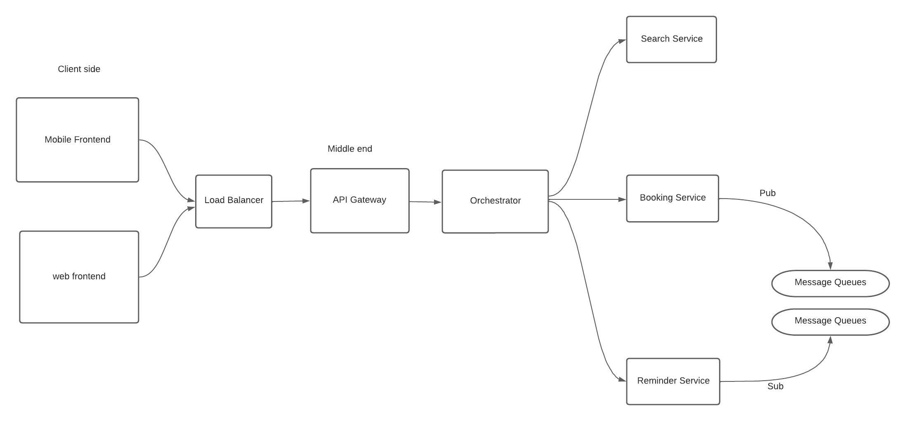

# Non Fuctional Requirements
> - We can expect more flight searches than bookings
> - The system needs to be reliable in terms of booking
> - Expect that we will be having 100000 total users
> - 100000 bookings might come up in  a quarter
> - 1 day you might be getting 100 bookings.
> - System should be able to make sure that we don't change
the prices when the payment is going on.
> - System should be able to autoscale itself for atleast 3x more traffic.

